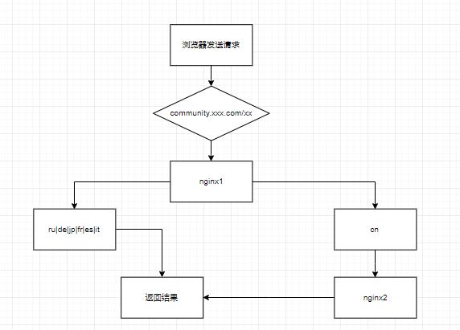

### nginx 反向代理相关问题

* 需求：

关于一个多语言站点的部署，只有中文站点在国内，多于站点部署在国外，国外是主营业务，所以国外算是主站点，域名类似`comunity.xx.com`,英语和小语
种都是通过`sg|au|fr|de|ru|jp|it`访问，国内通过`cn`访问，国内的在国内服务器，通过nginx代理访问国内。

* 环境

|语言|服务器|数据库|前台框架|后台框架 | 服务器化境
---- | ---- | ---- | ---- | ---- | ----
php7.2| nginx | mysql5.7| laravel5.8| laravel-admin | CentOS7

* 大致的访问流程， `nginx1`是`https`,`nginx2`是`http`



`comunity.xx.com/de|ru|jp|` 访问主服务器 `nginx1` 处理返回结果

`comunity.xx.com/cn` 访问主服务器 `nginx1`,服务器`nginx1`做一次代理转发到国内服务器`nginx2`，处理返回结果

* nginx1 配置

```
server {
     listen       80;
     server_name  php.xxx.com;
     root   html;
     index  index.html index.htm;

 }

server {
    listen       443;
    server_name  php.xxx.com;
    root   html;
    index  index.html index.htm;
    location ~ \.php$ {
        fastcgi_pass   127.0.0.1:9000;
        fastcgi_index  index.php;
        fastcgi_param  SCRIPT_FILENAME  /scripts$fastcgi_script_name;
        include        fastcgi_params;
    }
    
    location /cn {
        proxy_pass  http://192.168.1.100:6060;
        proxy_set_header Host $server_name;
        proxy_set_header X-Real-IP $remote_addr;#把源IP 【$remote_addr,建立HTTP连接header里面的信息】赋值给X-Real-IP
        proxy_set_header X-Forwarded-For $proxy_add_x_forwarded_for;#在nginx 作为代理服务器时，设置的IP列表，会把经过的机器ip，代理机器ip都记录下来
    }
}
```

* nginx2 配置

```
server {
    listen       6060;
    server_name  localhost;
    root   html;
    index  index.html index.htm;
    location ~ \.php$ {
        fastcgi_pass   127.0.0.1:9000;
        fastcgi_index  index.php;
        fastcgi_param  SCRIPT_FILENAME  /scripts$fastcgi_script_name;
        include        fastcgi_params;
    }
    
    location /cn {
        proxy_pass  http://192.168.1.100:6060;
        proxy_set_header Host $server_name;
        proxy_set_header X-Real-IP $remote_addr;#把源IP 【$remote_addr,建立HTTP连接header里面的信息】赋值给X-Real-IP
        proxy_set_header X-Forwarded-For $proxy_add_x_forwarded_for;#在nginx 作为代理服务器时，设置的IP列表，会把经过的机器ip，代理机器ip都记录下来
    }
}
```

* 遇到问题

1. 在本地部署一台服务，然后在虚拟机部署一台服务，模拟线上环境，在切换到`cn`站点的时候，可以正确使用`laravel` `route()`函数得到正确的url链接,
但是在正式环境，使用`route()`函数得到的链接是`php.xxx.com/abc`少了`cn`。我想要得到的是`php.xxx.com/cn/abc`，
使用`reauest()->url()`得到的当前链接，在`cn`站点也是会少了`cn`。路由写的都是正确的，输入路由都可以得到正确的网页，所以不会是路由写错了的问
题。后来通过设置`app('url')->forceScheme('https');app('url')->forceRootUrl('https://php.xxx.com/cn');`可以生成我想要的链
接了，但是`reauest()->url()`这个函数目前依然生成的链接缺少`cn`,目前我已经尽量复原线上的环境了，本地测试没有问题，但是到线上还是有点问题。
虽然使用别的方式解决了生成当前链接的问题，但是使用`reauest()->url()`这个函数依然会有问题，除非我不使用laravel中的生成链接的函数，但是项目
中使用`route()`函数的地方太多了。

2. 再说后台的问题，`laravel-admin`的后台，开启了配置文件`admin.php`中的https`'secure' => env('ADMIN_HTTPS', false),` 访问链接也是
问题不断，使用`URL::current()`函数拿取当前链接，链接拿取不到，拿到的链接只有协议，没有域名。加载的静态资源还是加载的主服务器的静态资源，把
静态资源加上`cn`会显示`404`的状态码。

****************** 

目前的思路就是从两方面，一个是nginx的代理方面，一个是框架代码方面。暂未解决

