### MYSQL基础知识巩固

* mysql客户端登录

```
mysql -uroot -p
```
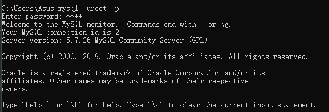

* 查看所有的数据库命令

```mysql
show databases;
```


数据库的四种语言

* 数据库定义语言(DDL) `create alter drop`

* 数据操纵语言(DML) `insert update delete`

* 数据查询语言(DQL) `select`

* 数据库控制语言(DCL) `grant commit rollback`

* 创建一个测试数据库`db_test1`

```mysql
create database db_test1;

create database if not exists db_test1;
```

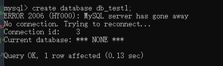
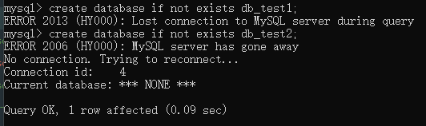

* 创建一个数据库并设置它的字符集,如果不设置字符集，默认的就是`utf8`字符集，校验规则就是`utf8_unicode_ci`

ps 校验规则:排序，`utf8_unicode_ci`不区分大小写， `utf8mb4_bin`二级制存储，区分大小写

* 查看字符集

```mysql
show character set;
```

* 查看所有的校验规则

```mysql
show collation;
```

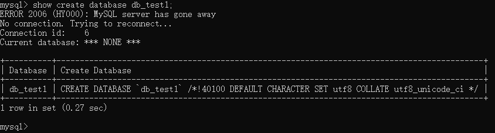

```mysql
create database db_test3 character set utf8;
```

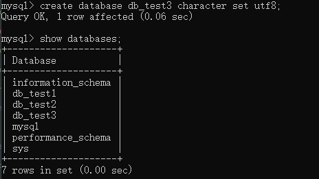

* 查看数据库的创建语句 

```mysql
show create database db_test3;
```

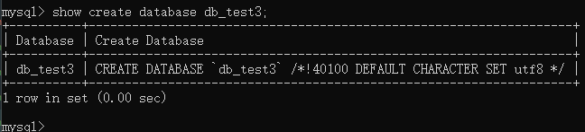

* 删除一个数据库

```mysql
drop database db_test1;
```

* 删除一个数据库如果存在

```mysql
drop database if exists db_test2;
```

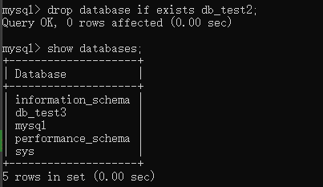

* 创建一个为test1和test2的数据表，验证规则使用`utf8_unicode_ci` , `utf8mb4_bin`

```mysql
create table if not exists `test1` (
`id` int primary key auto_increment,
`name` varchar(12)
) default character set utf8 collate utf8_unicode_ci;

insert into `test1` (`name`) values ('a');
insert into `test1` (`name`) values ('A');


create table if not exists `test2` (
`id` int primary key auto_increment,
`name` varchar(12)
) default character set utf8 collate utf8_bin;

insert into `test2` (`name`) values ('a');
insert into `test2` (`name`) values ('A');
```
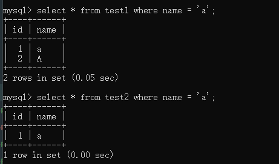

* 删除一个表 

```mysql
create table if not exists `test3` (`name` varchar(20)) engine = 'innodb' default character set utf8 collate utf8_unicode_ci;

drop table if exists `test3`;
```
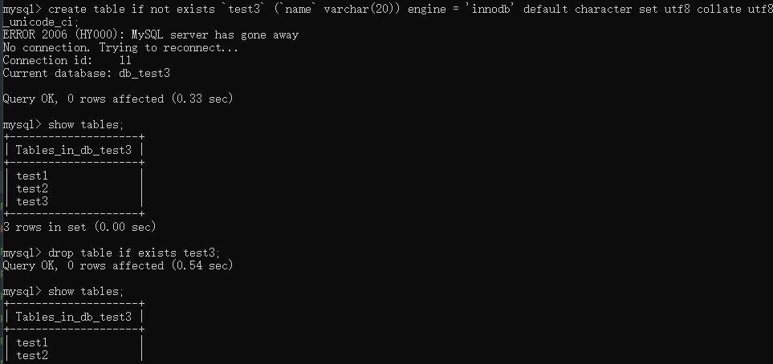

* 查看当前mysql的链接情况

```mysql
show processlist;
```
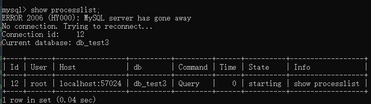

* 备份数据库， 参数 `-B` 会自动把数据库的创建都备份了

```
mysqldump -uroot -p 数据库名称 > 数据库存放路径

备份个别数据表

mysqldump -uroot -p 数据库名称 数据表1 数据表2 > 数据存放路径
```
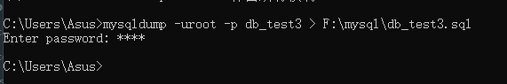

* 备份多个数据库

```
mysqldump -uroot -p -B 数据库1 数据库2 > 数据存放路径
```

* 恢复备份数据

```
source 备份文件的路径
```

* 修改数据库 `alter` 修改字符集，修改校验规则，修改存储引擎

```mysql
alter database db_test3 character set gbk;

alter database db_test3 charset = utf8;

alter database db_test3 collate utf8_bin;
```

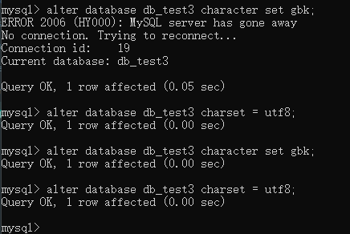


